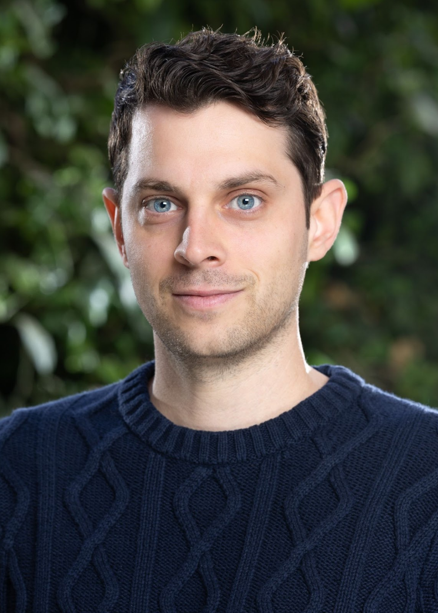
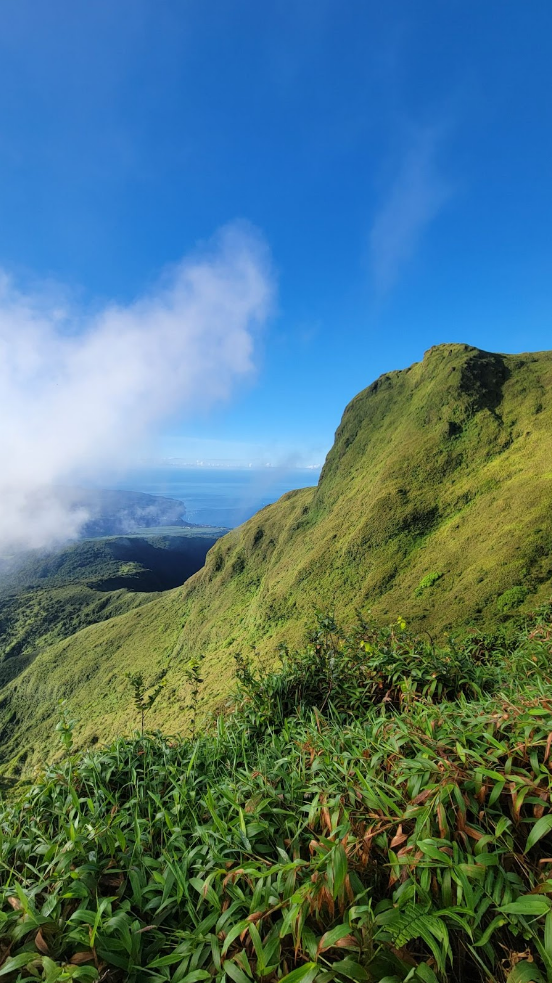
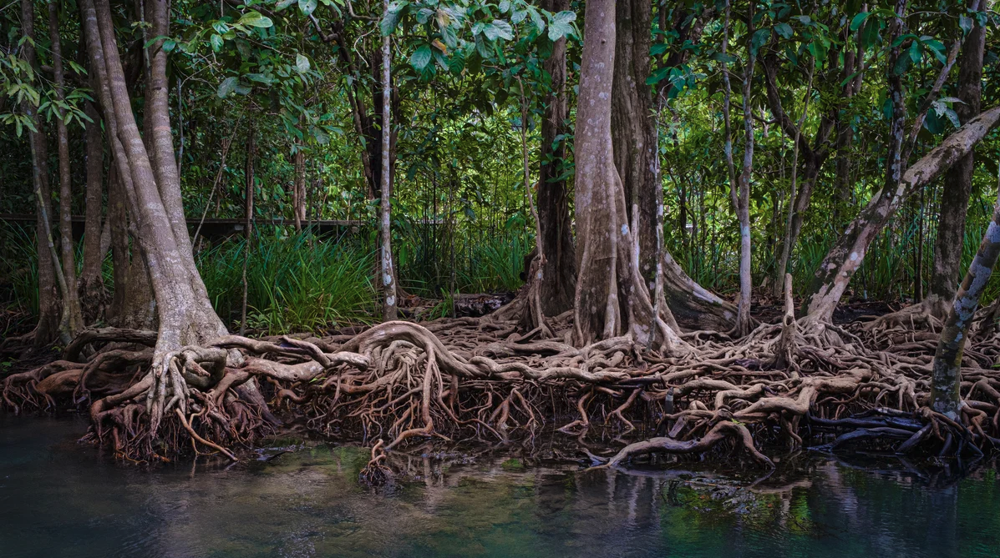

{fig-align="left" width=120px style="border-radius: 50%; margin-right: 1.5em; float: left;"}

Environmental Humanities · Caribbean Studies · Comparative Literature (French/English/Spanish)

[Email](mailto:davidavivian@gmail.com) | [CV](Vivian_CV.pdf) | [ORCID](https://orcid.org/0009-0005-4482-3273)

## About

A specialist in Caribbean and francophone literatures, I situate much of my work within the environmental humanities. My first monograph _Decolonial Ecologies in Francophone Caribbean Literature: From Messiahs to Mangroves_ (Liverpool UP, expected 2027) develops the concept of "eco-epistemology." Against the instrumentalist legacies of colonial capitalism, I read authors such as Suzanne and Aimé Césaire, Patrick Chamoiseau, Maryse Condé, Édouard Glissant, Yanick Lahens, and Gisèle Pineau to elucidate a critique of social and ecological messianism, gesturing instead toward relational and decolonial alternatives.

In addition, I am editing a scholarly volume entitled _Toxic Narratives: Global Perspectives on Toxicity from the Environmental Humanities_ (under contract with Routledge's Environmental Humanities series), and preparing a translation of Patrick Chamoiseau's novel _Les neuf consciences du Malfini_.

{width=220px fig-align="center"}

<small style="display: block; margin-top: 0.1em; line-height: 1.3;">Photo taken while hiking Martinique's Mont Pelée volcano, January 2025</small>

## Education {.section-title}

- **Ph.D. in Comparative Literature and French**, University of California, Santa Barbara, 2023
  Dissertation: _From Messiahs to Mangroves: Towards a Caribbean Eco-Epistemology_ [[link](https://www.proquest.com/openview/e0214c5582408015f9e7a6c24c6fdab8/1?pq-origsite=gscholar&cbl=18750&diss=y)]

- **M.A. in Comparative Literature and French**, University of California, Santa Barbara, 2018

- **B.A. in Literature**, University of California, Santa Cruz, 2015

## Teaching Experience and Philosophy {.section-title}

::: columns
- Visiting Assistant Professor of French & Francophone Studies, Soka University (2024–26)

- Visiting Assistant Professor of French, Skidmore College (2023-24)

- Visiting Lecturer of English/Humanities, Université de Paris-VIII (2022)

- Instructor, English as a Second Language (ESL), El Encanto Hotel (2022)

- Graduate Student Instructor, Comparative Literature and French, UC Santa Barbara (2016-22)

I am committed to student-centered teaching in my courses, helping cultivate vital skills at a time when education is actively threatened. With extensive teaching experience at both liberal arts colleges and research universities, I am adept at fostering inclusive classrooms and connecting learning to critical issues, such as climate concerns, social justice, and knowledge in the age of AI.

**Selected Courses**

- Decolonial Ecologies of the Caribbean

- Informal Cities in the Francophone World

- Black Ecologies: Environmental (In)justice and Radical Resistance

- The Anthropocene: Rethinking the Human-Environment Relation

- Paris, 'la ville aux cent mille romans' (1830–1930)

:::

## Publications {.section-title}

### Monograph

- _Decolonial Ecologies in Francophone Caribbean Literature: From Messiahs to Mangroves_. Liverpool University Press, forthcoming 2027.

### Journal Articles

- "Reimagining Urban Ecology through Caribbean Science Fiction: Reading the Green Cities of Tobias Buckell and Stephanie Saulter." _Journal of Modern Literature_ 49.4 (October 2026), forthcoming.

- "Ecology Against Empire: The Césaires' Decolonial Ecology Avant La Lettre." Invited article for the special issue "Ecologies of Empire," _Bulletin of Francophone Postcolonial Studies_, forthcoming.

- "Non-Anthropocentric Ecologies in Jacques Stéphen Alexis's _Romancero aux étoiles_ and Yanick Lahens's _Bain de lune_." _Journal of Haitian Studies_ 28.1 (2022). [[link](https://muse.jhu.edu/article/781781/summary)]

- "Eco-Epistemology and Eschatology: Examining the Savior Complex in Jacques Roumain's _Gouverneurs de la rosée_ and Patrick Chamoiseau's _Les neuf consciences du Malfini_." _French Forum_ 45.2 (2020). [[link](https://www.jstor.org/stable/27136232)]

### Edited Volume

- Editor, _Toxic Narratives: Global Perspectives on Toxicity from the Environmental Humanities_. Under contract with Routledge (Routledge Environmental Humanities series; manuscript in progress).

### Interviews

- "A Conversation with Stephanie Saulter: Adaptation and Resilience in the Multicultural Sci-Fi City." In _Urban Discourses of Crisis, Resilience, and Resistance: Cities Under Stress_, eds. Lanigan, Lappälä, and Prieto. Palgrave Macmillan, 2025. [[link](https://link.springer.com/chapter/10.1007/978-3-031-86897-9_4)]

- "The Complexity of Community: Ecology, Science Fiction, and the Future of Literature — A Conversation with Tobias Buckell." _Journal of West Indian Literature_ 31.1 (2022). [[link](https://www.proquest.com/openview/c1012f2d699d34912c9426d8b0d1e49d/1?pq-origsite=gscholar&cbl=43885)]

- "Exploring Postcolonial Prejudice and Ecology through Science Fiction — An Interview with Stephanie Saulter." _sx salon_ 40 (2022). [[link](https://smallaxe.net/sxsalon/discussions/exploring-postcolonial-prejudice-and-ecology-through-science-fiction)]

### Book Review

- "_Que peut littérature quand elle ne peut?_ par Patrick Chamoiseau" (review). _French Review_ 99.4 (2026). [[link](https://muse.jhu.edu/pub/1/article/990133/pdf)]

### Under Review

- Editor (with Lauren D. Ravalico), _Narrating Toxicity: Cultural Responses to Environmental Harm in Francophone Cultures_. Under review at Liverpool UP.

- "Towards a Caribbean Holistic Ethics of Care: Postcolonial-Ecofeminist Stakes in Kei Miller's _Augustown_ and Maryse Condé's _Traversée de la mangrove_." In _The Handbook of Postcolonial Ecofeminist Literature_, eds. Douglas Vakoch and Aslı Değirmenci. Under review at Bloomsbury.

- "Space, Place, and the Rhetoric of Radicalism in Mahi Binebine's _Les Étoiles de Sidi Moumen_" (with Eric Prieto). Under review with _Francosphères_.

## Public Writing {.section-title}

- "The colonial legacy lurking beneath economic unrest in the French Caribbean." _The Conversation_, 1 November 2024. [[link](https://theconversation.com/the-colonial-legacy-lurking-beneath-economic-unrest-in-the-french-caribbean-242460)]

- "What Is Comparative Literature and Why Study It?" _Culture Frontier_, 12 May 2023. [[link](https://www.culturefrontier.com/comparative-literature/)]

## Selected Presentations {.section-title}

- "Toxicity and Coloniality." _Toxic Exposure: Chemicals in Contemporary Global Fiction_. The American Comparative Literature Association (ACLA) Annual Conference, May 29–June 1, 2025

- "Urban Poverty and the Promise of Paradise: Mahi Binebine's _Horses of God_." Soka University, EMP 335: Cities and Environment in the Global South (Prof. Deike Peters), October 3, 2024

- "Creole Creativity as Plantation Resistance: A Decolonial-Ecofeminist Perspective," Amherst College (Lecture sponsored by the Department of French), March 13, 2024

- "Emergent Eco-epistemology: Caribbean Ecopoetics and Climate Change." UCLA's Annual Southland Conference, "Emergences," August 10–11, 2021

- "The Haunting Past: Trauma, Time, and (Post)Memory in Patrick Modiano's _Dora Bruder_." The Centre for Comparative Literature's 29th Annual Conference, University of Toronto, March 29–30, 2019

## Contact {.section-title}

- Email: [davidavivian@gmail.com](mailto:davidavivian@gmail.com)

---

::: {.column-screen}
{.mangrove-footer fig-alt="Mangrove roots above water"}
:::

